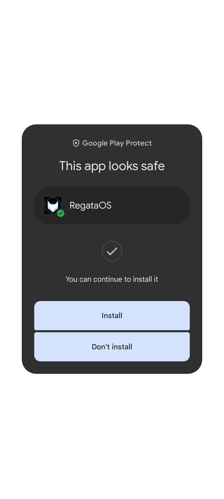

# Py_Connect
> PC (Py_Connect)

### What is RegataOS?

Visit: https://regataos.com

### How it works?

The system allows you to interact with transfers between devices in a simple and easy way. Once the connection happens, everything is around you (LAN Network). It works on Termux (Android) or using the app (not available on the Play Store). For desktop (PC), it works perfectly.

### Requirements:

- Flask.
-Python3.
- Unix/Linux based CLI.
- git.

### Compatible with:

Android: API 21 - 28 or higher.
CLI: PowerShell, Brew, Bash...

### Tutorial:

1 - Clone the project to your machine:

```
git clone https://github.com/Jetrom17/Py_Connect
```

2 - Access the `Py_Connect` folder and edit `up.py`, change it to the IP of your machine. On Linux, for example, you can check using the `ifconfing` command in the CLI. Your IP has the format `ipv4`.

3 - Run `python3 up.py`.

Exit:

```py
python3 up.py
  * Serving Flask app 'up' (lazy loading)
  * Environment: production
    WARNING: This is a development server. Do not use it in a production deployment.
    Use the production WSGI server instead.
  * Debug mode: on
  * Running on http://***:5000/ (Press CTRL+C to quit)
  * Restarting with stat
  * Debugger is active!
  * Debugger PIN: ***-***-***
   *** - [30/Dec/2023 11:27:19] "GET / HTTP/1.1" 200 -
```

### 4 - RegataOS App:


Download here:

https://github.com/Jetrom17/Py_Connect/raw/main/regataos.com.br_1.0.apk

# Brazil

# Py_Connect
> PC (Py_Connect)

### O que é RegataOS?

Visite: https://regataos.com

### Como funciona?

O sistema permite que você interage com transferências entre dispositivos de maneira simples e fácil. Uma vez que a conexão acontece tudo em sua volta (Rede LAN). Funciona no Termux (android) ou com uso do aplicativo (não disponivel na Play Store). Para desktop (PC), funciona perfeitamente.

### Requerimentos:

- Flask.
- Python3.
- CLI baseado em Unix/Linux.
- git.

### Compativel com:

Android: API 21 - 28 ou superior.
CLI: PowerShell, Brew, Bash...

### Tutorial:

1 - Clone o projeto para sua máquina:

```
git clone https://github.com/Jetrom17/Py_Connect
```

2 - Acesse a pasta `Py_Connect` e edite `up.py`, altere pelo IP da sua máquina. No linux por exemplo, pode verificar pelo comando `ifconfing` no CLI. Seu IP tem formato `ipv4`.

3 - Execute `python3 up.py`.

Saída:

```py
python3 up.py 
 * Serving Flask app 'up' (lazy loading)
 * Environment: production
   WARNING: This is a development server. Do not use it in a production deployment.
   Use a production WSGI server instead.
 * Debug mode: on
 * Running on http://***:5000/ (Press CTRL+C to quit)
 * Restarting with stat
 * Debugger is active!
 * Debugger PIN: ***-***-***
  *** - [30/Dec/2023 11:27:19] "GET / HTTP/1.1" 200 -
```

### 4 - Aplicativo RegataOS:


Baixe aqui: 

https://github.com/Jetrom17/Py_Connect/raw/main/regataos.com.br_1.0.apk
